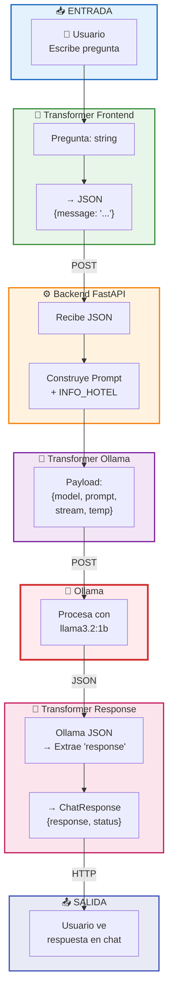

```mermaid
graph TD
    subgraph Entrada["📥 ENTRADA"]
        U["👤 Usuario<br/>Escribe pregunta"]
    end
    
    subgraph T1["🔄 Transformer Frontend"]
        T1A["Pregunta: string"]
        T1B["→ JSON<br/>{message: '...'}"]
    end
    
    subgraph Backend["⚙️ Backend FastAPI"]
        B1["Recibe JSON"]
        B2["Construye Prompt<br/>+ INFO_HOTEL"]
    end
    
    subgraph T2["🔄 Transformer Ollama"]
        T2A["Payload:<br/>{model, prompt,<br/>stream, temp}"]
    end
    
    subgraph AI["🤖 Ollama"]
        O["Procesa con<br/>llama3.2:1b"]
    end
    
    subgraph T3["🔄 Transformer Response"]
        T3A["Ollama JSON<br/>→ Extrae 'response'"]
        T3B["→ ChatResponse<br/>{response, status}"]
    end
    
    subgraph Salida["📤 SALIDA"]
        S["Usuario ve<br/>respuesta en chat"]
    end
    
    U --> T1A
    T1A --> T1B
    T1B -->|POST| B1
    B1 --> B2
    B2 --> T2A
    T2A -->|POST| O
    O -->|JSON| T3A
    T3A --> T3B
    T3B -->|HTTP| S
    
    style Entrada fill:#e3f2fd,stroke:#1565c0,stroke-width:2px
    style T1 fill:#e8f5e9,stroke:#388e3c,stroke-width:2px
    style Backend fill:#fff3e0,stroke:#f57c00,stroke-width:2px
    style T2 fill:#f3e5f5,stroke:#7b1fa2,stroke-width:2px
    style AI fill:#ffebee,stroke:#d32f2f,stroke-width:3px
    style T3 fill:#fce4ec,stroke:#c2185b,stroke-width:2px
    style Salida fill:#e8eaf6,stroke:#3f51b5,stroke-width:2px
    
    style Entrada fill:#e3f2fd,stroke:#1565c0,stroke-width:2px
    style T1 fill:#e8f5e9,stroke:#388e3c,stroke-width:2px
    style Backend fill:#fff3e0,stroke:#f57c00,stroke-width:2px
    style T2 fill:#f3e5f5,stroke:#7b1fa2,stroke-width:2px
    style AI fill:#ffebee,stroke:#d32f2f,stroke-width:3px
    style T3 fill:#fce4ec,stroke:#c2185b,stroke-width:2px
    style Salida fill:#e8eaf6,stroke:#3f51b5,stroke-width:2px
```